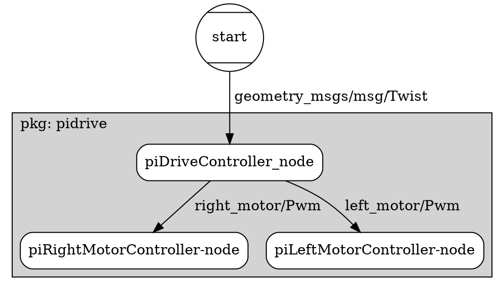
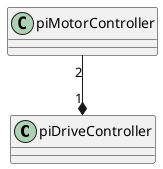

### Topic flow

---

### Class diagram

---

### Responsibility

| Node | Responsibility|
| :--- | :--- |
|piDriveControll| convert cmd_vel to PWM. |
|piMotorControll| - write PWM parameter to gpio. |
